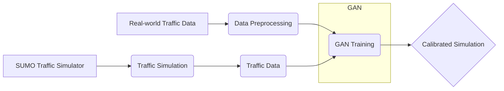

# Future Work

**Project Goal:** To develop a robust and generalizable GAN-based calibration framework for traffic microsimulation.

**Current Status:** The project has a basic GAN-based calibration pipeline for a simple on-ramp scenario. The `README.md` file has been updated to reflect a more generic repository structure.

**Future Work:**
1.  **Generate more interesting SUMO data for training**
1. under sumo/on_ramp, modify onramp.rou.xml such that the mainline frlow and ramp_0 flow change every 30 sec interval. The overall flow both on mainline and ramp_0 starts low, and then increase to peak, and then decrease.
2. the parameters in vType id="trial" should follow a gaussian distritribution. define that distribution in config.json. The distributions should be different for real data and fake data generation. 

 **Implement cGAN-based rare event synthesis:**
    *   Use cGANs to generate rare but critical traffic events for safety evaluation.
    *   This will involve training the cGAN on real-world traffic data that includes rare events such as accidents, incidents, and extreme weather conditions.
    *   The generated rare events can then be used to test the robustness of autonomous vehicles and traffic management systems.
**Integrate with conditional inputs:**
    *   Incorporate conditional inputs such as weather or demand levels into the GAN to generate more realistic and context-aware traffic scenarios.
    *   This will involve modifying the GAN architecture to accept conditional inputs and training the GAN on data that includes these inputs.
    *   The conditional inputs can be used to generate traffic scenarios that reflect different weather conditions, demand levels, and other factors.
 **Develop more sophisticated discriminator architectures:**
    *   Experiment with different discriminator architectures to improve the accuracy and robustness of the GAN.
    *   This will involve exploring different neural network architectures, loss functions, and training techniques.
    *   The goal is to develop a discriminator that can accurately distinguish between real and simulated traffic data, even in the presence of noise and uncertainty.
**Develop more realistic generator models:**
    *   Explore different ways to integrate the SUMO traffic simulator with the GAN to create more realistic generator models.
    *   This will involve experimenting with different SUMO parameters and configurations, as well as developing new methods for generating traffic data.
    *   The goal is to develop a generator model that can accurately simulate real-world traffic dynamics, including complex emergent behaviors.
**Evaluate the performance of the GAN-based calibration framework on real-world traffic data:**
    *   Evaluate the performance of the GAN-based calibration framework on real-world traffic data from different locations and time periods.
    *   This will involve comparing the simulation results with real-world traffic data and evaluating the accuracy and robustness of the calibration framework.
    *   The goal is to demonstrate that the GAN-based calibration framework can be used to accurately calibrate traffic microsimulations in a variety of real-world scenarios.
 **Develop a user-friendly interface for the GAN-based calibration framework:**
    *   Develop a user-friendly interface for the GAN-based calibration framework that allows users to easily train and evaluate the GAN.
    *   This will involve creating a graphical user interface (GUI) or a command-line interface (CLI) that allows users to specify the training data, the GAN architecture, and the evaluation metrics.
    *   The goal is to make the GAN-based calibration framework accessible to a wider audience of transportation researchers and engineers.

## Mermaid Diagrams

**Project Architecture:**



**Data Flow:**

```mermaid
graph LR
    A[Real-world Traffic Data] --> B(Data Preprocessing)
    B --> C{Discriminator}
    D[SUMO Traffic Simulator] --> E(Traffic Simulation)
    E --> F(Traffic Data)
    F --> C
    C -- "Real/Fake Score" --> G(Optimization Algorithm)
    G --> D